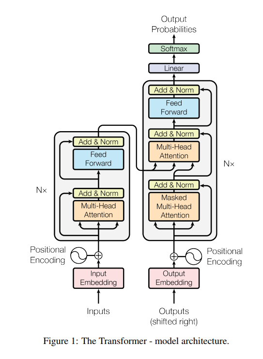
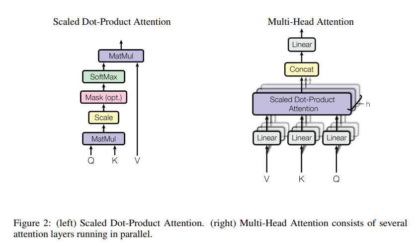

# Tutorial

The following content will cover the basic introductions about the Transformer model and the implementation.

## Transformer model

The Transformer model was proposed in the paper: [Attention Is All You Need](https://arxiv.org/abs/1706.03762). In that paper they provide a new way of handling the sequence transduction problem (like the machine translation task) without complex recurrent or convolutional structure. Simply use a stack of attention mechanisms to get the latent structure in the input sentences and a special embedding (positional embedding) to get the locationality. The whole model architecture looks like this:

The Transformer model architecture (picture from the origin paper)

### Multi-Head Attention

Instead of using the regular attention mechanism, they split the input vector to several pairs of subvector and perform a dot-product attention on each subvector pairs.

Regular attention v.s. Multi-Head attention (picture from the origin paper)

For those who like mathematical expression, here is the formula:

```math
Attention(Q, K, V) = softmax(\frac{QK^T}{\sqrt{d_k}})V
```

```math
MultiHead(Q, K, V) = Concat(head_1,..., head_h)W^O
\text{where }head_i = Attention(QW^Q_i, KW^K_i, VW^V_i)
```

### Positional Embedding

As we mentioned above, transformer model didn't depend on the recurrent or convolutional structure. On the other hand, we still need a way to differentiate two sequence with same words but different order. Therefore, they add the locational information on the embedding, i.e. the origin word embedding plus a special embedding that indicate the order of that word. The special embedding can be computed by some equations or just use another trainable embedding matrix. In the paper, the positional embedding use this formula:

```math
PE_{(pos, k)} = \begin{cases}
sin(\frac{pos}{10^{4k/d_k}}),& \text{if }k \text{ is even}\\
cos(\frac{pos}{10^{4k/d_k}}), & \text{if }k \text{ is odd}
\end{cases}
```

where $pos$ is the locational information that tells you the given word is the $pos$\-th word, and $k$ is the $k$\-th dimension of the input vector. $d\_k$ is the total length of the word/positional embedding. So the new embedding will be computed as:

```math
Embedding_k(word) = WordEmbedding_k(word) + PE(pos\_of\_word, k)
```

## Transformers.jl

Now we know how the transformer model looks like, let's take a look at the Transformers.jl.

### Example

!!! info
    This tutorial is just for demonstrating how the Transformer model looks like, not for using in real task.
     The example code can be found in the
	 [example folder](https://github.com/chengchingwen/Transformers.jl/tree/master/example/AttentionIsAllYouNeed).

To best illustrate the usage of Transformers.jl, we will start with building a two layer Transformer model on a sequence copy task. Before we start, we need to install all the package we need:

```julia
using Pkg
Pkg.add("CUDA")
Pkg.add("Flux")
Pkg.add("Transformers")
```

We use [CUDA.jl](https://github.com/JuliaGPU/CUDA.jl) for the GPU support.

```julia
using Flux
using CUDA
using Transformers
using Transformers.Layers
using Transformers.TextEncoders

enable_gpu(CUDA.functional()) # make `todevice` work on gpu if available
```

### Copy task

The copy task is a toy test case of a sequence transduction problem that simply return the same sequence as the output. Here we define the input as a random sequence of white space separable number from 1~10 and length 10. we will also need a start and end symbol to indicate where is the begin and end of the sequence. We can use `Transformers.TextEncoders.TransformerTextEncoder` to preprocess the input (add start/end symbol, convert to one-hot encoding, ...).

```julia
labels = map(string, 1:10)
startsym = "<s>"
endsym = "</s>"
unksym = "<unk>"
labels = [unksym, startsym, endsym, labels...]

textenc = TransformerTextEncoder(split, labels; startsym, endsym, unksym, padsym = unksym)
```

```julia
# function for generate training datas
sample_data() = (d = join(map(string, rand(1:10, 10)), ' '); (d,d))

@show sample = sample_data()
# encode single sentence
@show encoded_sample_1 = encode(textenc, sample[1])
# encode for both encoder and decoder input
@show encoded_sample = encode(textenc, sample[1], sample[2])
```

```
sample = sample_data() = ("5 1 10 10 7 3 3 4 9 6", "5 1 10 10 7 3 3 4 9 6")
encoded_sample_1 = encode(textenc, sample[1]) = (token = Bool[0 0 0 0 0 0 0 0 0 0 0 0; 1 0 0 0 0 0 0 0 0 0 0 0; 0 0 0 0 0 0 0 0 0 0 0 1; 0 0 1 0 0 0 0 0 0 0 0 0; 0 0 0 0 0 0 0 0 0 0 0 0; 0 0 0 0 0 0 1 1 0 0 0 0; 0 0 0 0 0 0 0 0 1 0 0 0; 0 1 0 0 0 0 0 0 0 0 0 0; 0 0 0 0 0 0 0 0 0 0 1 0; 0 0 0 0 0 1 0 0 0 0 0 0; 0 0 0 0 0 0 0 0 0 0 0 0; 0 0 0 0 0 0 0 0 0 1 0 0; 0 0 0 1 1 0 0 0 0 0 0 0], attention_mask = NeuralAttentionlib.LengthMask{1, Vector{Int32}}(Int32[12]))
encoded_sample = encode(textenc, sample[1], sample[2]) = (encoder_input = (token = Bool[0 0 0 0 0 0 0 0 0 0 0 0; 1 0 0 0 0 0 0 0 0 0 0 0; 0 0 0 0 0 0 0 0 0 0 0 1; 0 0 1 0 0 0 0 0 0 0 0 0; 0 0 0 0 0 0 0 0 0 0 0 0; 0 0 0 0 0 0 1 1 0 0 0 0; 0 0 0 0 0 0 0 0 1 0 0 0; 0 1 0 0 0 0 0 0 0 0 0 0; 0 0 0 0 0 0 0 0 0 0 1 0; 0 0 0 0 0 1 0 0 0 0 0 0; 0 0 0 0 0 0 0 0 0 0 0 0; 0 0 0 0 0 0 0 0 0 1 0 0; 0 0 0 1 1 0 0 0 0 0 0 0], attention_mask = NeuralAttentionlib.LengthMask{1, Vector{Int32}}(Int32[12])), decoder_input = (token = Bool[0 0 0 0 0 0 0 0 0 0 0 0; 1 0 0 0 0 0 0 0 0 0 0 0; 0 0 0 0 0 0 0 0 0 0 0 1; 0 0 1 0 0 0 0 0 0 0 0 0; 0 0 0 0 0 0 0 0 0 0 0 0; 0 0 0 0 0 0 1 1 0 0 0 0; 0 0 0 0 0 0 0 0 1 0 0 0; 0 1 0 0 0 0 0 0 0 0 0 0; 0 0 0 0 0 0 0 0 0 0 1 0; 0 0 0 0 0 1 0 0 0 0 0 0; 0 0 0 0 0 0 0 0 0 0 0 0; 0 0 0 0 0 0 0 0 0 1 0 0; 0 0 0 1 1 0 0 0 0 0 0 0], attention_mask = NeuralAttentionlib.LengthMask{1, Vector{Int32}}(Int32[12]), cross_attention_mask = NeuralAttentionlib.BiLengthMask{1, Vector{Int32}}(Int32[12], Int32[12])))
```

### Defining the model

With the Transformers.jl and Flux.jl, we can define the model easily. We use a Transformer with 512 hidden size and 8 head.

```julia
# model setting
N = 2
hidden_dim = 512
head_num = 8
head_dim = 64
ffn_dim = 2048

# define a Word embedding layer which turn word index to word vector
word_embed = Embed(hidden_dim, length(textenc.vocab)) |> todevice

# define a position embedding layer metioned above
# since sin/cos position embedding does not have any parameter, `todevice` is not needed.
pos_embed = SinCosPositionEmbed(hidden_dim)

# define 2 layer of transformer
encoder_trf = Transformer(TransformerBlock, N, head_num, hidden_dim, head_dim, ffn_dim) |> todevice

# define 2 layer of transformer decoder
decoder_trf = Transformer(TransformerDecoderBlock, N, head_num, hidden_dim, head_dim, ffn_dim) |> todevice

# define the layer to get the final output probabilities
# sharing weights with `word_embed`, don't/can't use `todevice`.
embed_decode = EmbedDecoder(word_embed)

function embedding(input)
    we = word_embed(input.token)
    pe = pos_embed(we)
    return we .+ pe
end

function encoder_forward(input)
    attention_mask = get(input, :attention_mask, nothing)
    e = embedding(input)
    t = encoder_trf(e, attention_mask) # return a NamedTuples (hidden_state = ..., ...)
    return t.hidden_state
end

function decoder_forward(input, m)
    attention_mask = get(input, :attention_mask, nothing)
    cross_attention_mask = get(input, :cross_attention_mask, nothing)
    e = embedding(input)
    t = decoder_trf(e, m, attention_mask, cross_attention_mask) # return a NamedTuple (hidden_state = ..., ...)
    p = embed_decode(t.hidden_state)
    return p
end
```

Then run the model on the sample

```julia
enc = encoder_forward(encoded_sample.encoder_input)
logits = decoder_forward(encoded_sample.decoder_input, enc)
```

The whole model can be defined without those _forward_ functions. See the example folder and [docs of the Layer API](layers.md) for more information.

### define the loss and training loop

For the last step, we need to define the loss function and training loop. We use the kl divergence for the output probability.

```julia
using Flux.Losses # for logitcrossentropy

# define loss function
function shift_decode_loss(logits, trg, trg_mask)
    label = trg[:, 2:end, :]
    return logitcrossentropy(@view(logits[:, 1:end-1, :]), label, trg_mask - 1)
end

function loss(input)
    enc = encoder_forward(input.encoder_input)
    logits = decoder_forward(input.decoder_input, enc)
    ce_loss = shift_decode_loss(logits, input.decoder_input.token, input.decoder_input.attention_mask)
    return ce_loss
end

# collect all the parameters
ps = Flux.params(word_embed, encoder_trf, decoder_trf)
opt = ADAM(1e-4)

# function for created batched data
using Transformers.Datasets: batched

# flux function for update parameters
using Flux: gradient
using Flux.Optimise: update!

preprocess(sample) = todevice(encode(textenc, sample[1], sample[2]))

# define training loop
function train!()
    @info "start training"
    for i = 1:1000
        sample = batched([sample_data() for i = 1:32]) # create 32 random sample and batched
        input = preprocess(sample)
        grad = gradient(()->loss(input), ps)
        if i % 8 == 0
            l = loss(input)
            println("loss = $l")
        end
        update!(opt, ps, grad)
    end
end
```

```julia
train!()
```

### Test our model

After training, we can try to test the model.

```julia
function translate(x::AbstractString)
    ix = todevice(encode(textenc, x).token)
    seq = [startsym]

    encoder_input = (token = ix,)
    enc = encoder_forward(encoder_input)

    len = size(ix, 2)
    for i = 1:2len
        decoder_input = (token = todevice(lookup(textenc, seq)),)
        logit = decoder_forward(decoder_input, enc)
        ntok = decode(textenc, argmax(logit[:, end]))
        push!(seq, ntok)
        ntok == endsym && break
    end
    return seq
end
```

```julia
translate(map(string, [5,5,6,6,1,2,3,4,7, 10]))
```

```
10-element Vector{String}:
 "5"
 "5"
 "6"
 "6"
 "1"
 "2"
 "3"
 "4"
 "7"
 "10"

```

The result looks good!
